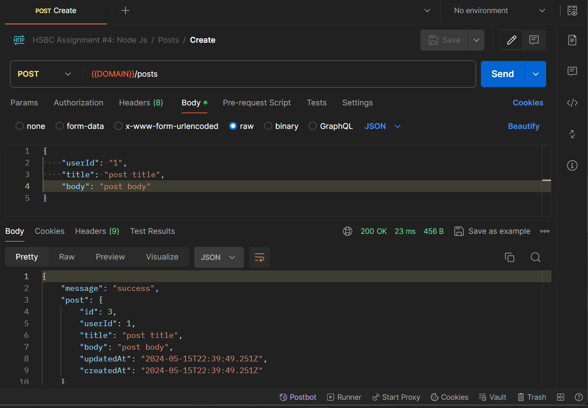
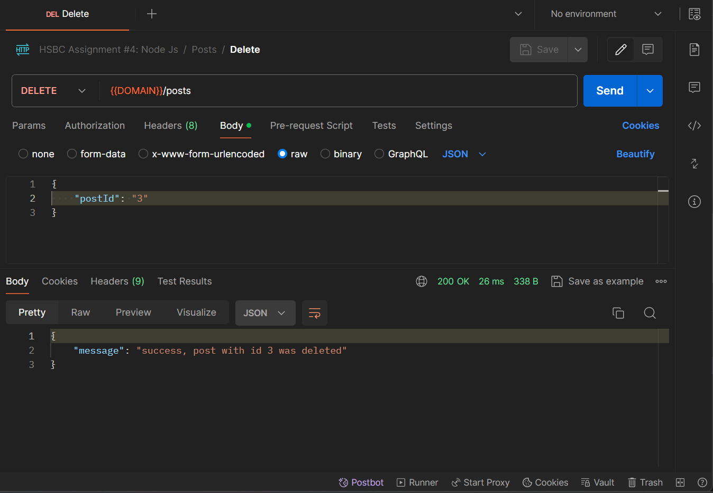
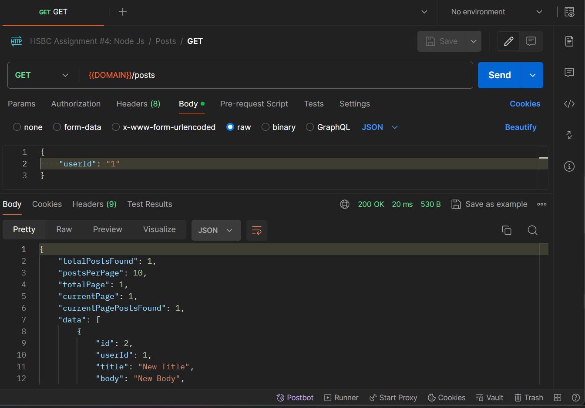
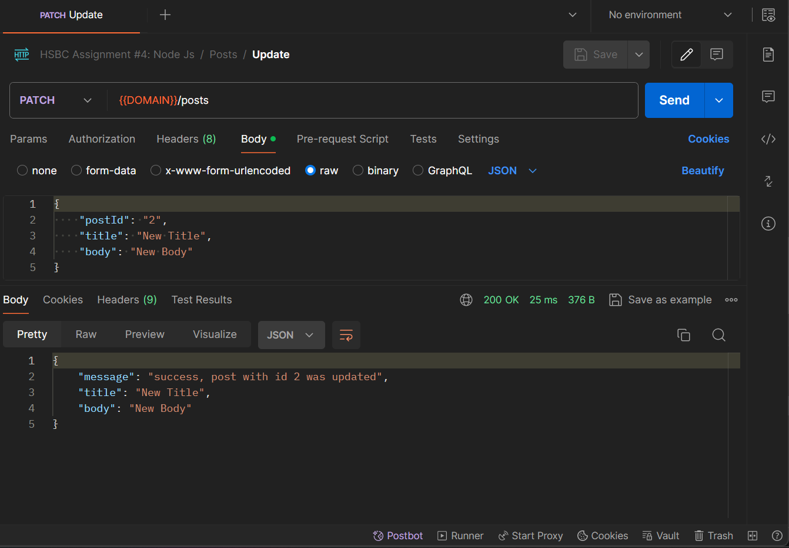
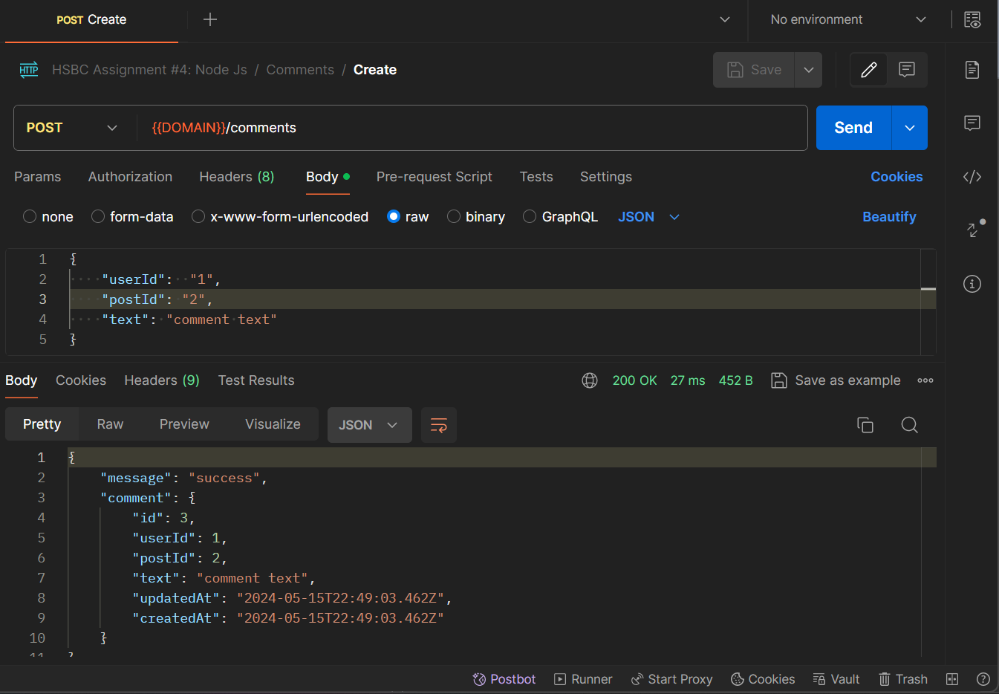
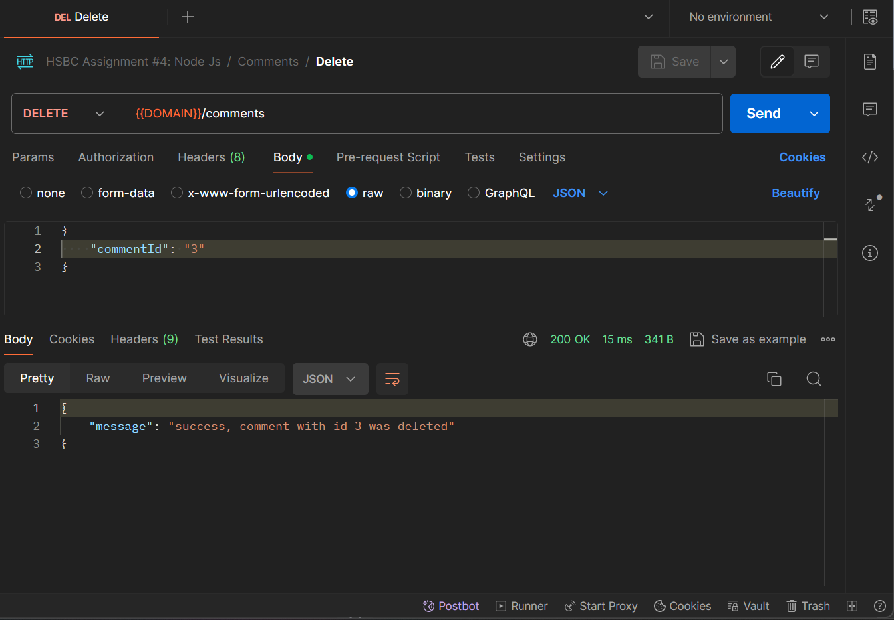
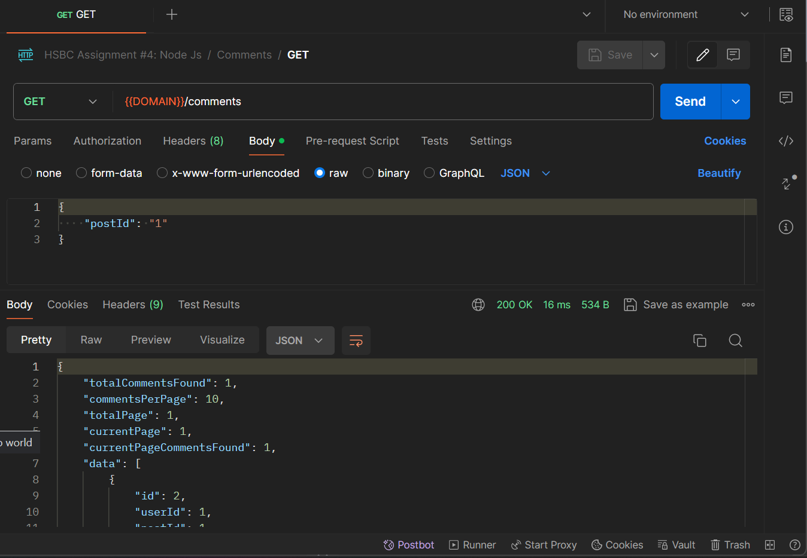
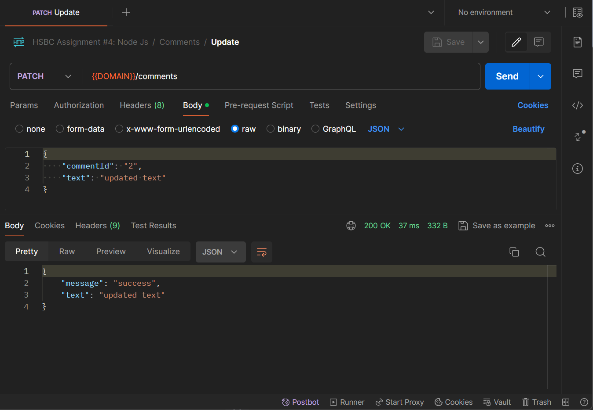

# HSBC Assignment #4: NodeJs
In this assignment, students were asked to add a new service to an existing RESTful API project (web content management API) created with NodeJs (using expressJs) and MySql (using sequelize).

## Service added
1. Posts
2. Comments

```
<!-- ./src/index.js -->
const postRoute = require('./routes/post.route');
const commentRoute = require('./routes/comment.route');

app.use('/posts', postRoute);
app.use('/comments', commentRoute);
```

### Posts
1. Create Post
  
2. Delete Post

3. Get Posts that created by a specific user

4. Update Post



### Comments
1. Create Comments

2. Delete Comments

3. Get Comments for a specific post

4. Update Comments


## Other improvements
1. Create universal error handling middleware

```
<!-- ./src/middlewars/processError.js -->
const processError = (error, req, res, next) => {

    return res.status(500).json({
        message: error.message || 'operation failed, an error occured'
    })
}

module.exports = processError;

<!-- ./src/index.js -->
app.use(processError);

```

## Step to Recreate Project
1. Create .env file and copy and fill in all the required variable from .env.example
2. Run ``` npm run migrate ```